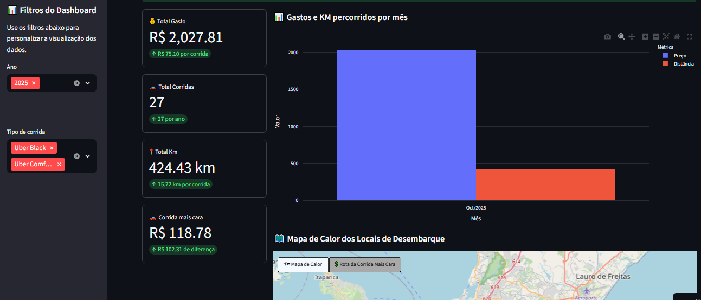
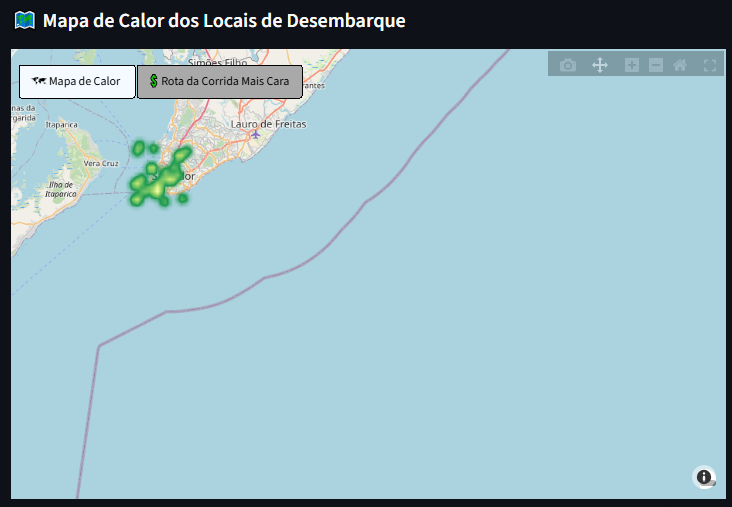
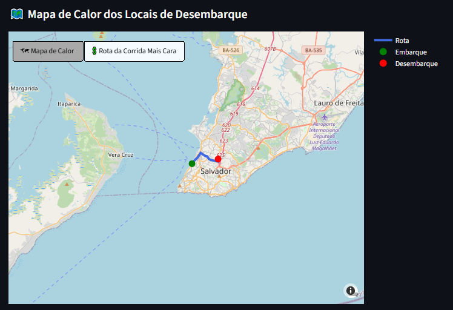

# 🚙 Uber Expense Analytics

[](https://uber-expense-analytics.streamlit.app/)
[](LICENSE)
[](https://www.python.org/downloads/)

An interactive web application for comprehensive analysis of your Uber expenses. Visualize spending, distances traveled, heat maps, and routes of your most expensive trips.

## 📊 Features

- **📈 Interactive Dashboard**: View key metrics like total spent, number of trips, and mileage
- **🗓️ Advanced Filters**: Filter by year and ride type (UberX, Uber Comfort, etc.)
- **📊 Dynamic Charts**: Track spending and km traveled month by month
- **🗺️ Heat Map**: Visualize your most frequent drop-off locations
- **🚗 Most Expensive Trip Route**: See the complete route of your most costly trip
- **📥 Data Export**: Download spreadsheets with filtered data

## 🎯 How to Use

### 1. Access the Application

Visit [uber-expense-analytics.streamlit.app](https://uber-expense-analytics.streamlit.app/)

### 2. Export Your Uber Data

<div style="display: flex;">
<div style="flex: 1; padding: 10px;">

To get your Uber trip history:

1. **Access Uber Website**
   - Go to [https://privacy.uber.com/exploreyourdata/](https://privacy.uber.com/exploreyourdata/)
   - Log in with your account

2. **Navigate to Download**
   - Click on the top menu
   - Select **"Download"**
   - Click on **"Download your data"**

3. **Request the Export**
   - Check the **"Trip history"** option
   - Click **"Submit request"**
   - Wait for the confirmation email (can take a few minutes or up to 24 hours)

4. **Download the File**
   - You'll receive an email with a download link
   - Download the ZIP file
   - Extract the `trips_data.csv` file

</div>
<div style="flex: 1; padding: 10px; margin-left: 10px; text-align: center;">


</div>
</div>

### 3. Faça Upload na Aplicação

1. In the application, click the **"Browse files"** button or drag your CSV file (eg. `trips_data-0.csv`) into the upload area
2. Wait for data processing
3. Explore the charts and metrics on the dashboard
4. Use the sidebar filters to customize the view

## 📸 Screenshots

### Main Dashboard
The dashboard displays key metrics and interactive charts of your expenses.



### Heat Map
Visualize the locations where you use Uber most through an interactive heat map.



### Most Expensive Trip Route
See the complete route of your most costly trip with pick-up and drop-off points.



## 🛠️ Technologies Used

- **[Streamlit](https://streamlit.io/)**: Framework for web application creation
- **[Pandas](https://pandas.pydata.org/)**: Data manipulation and analysis
- **[Plotly](https://plotly.com/)**: Interactive charts and maps
- **[OpenRouteService](https://openrouteservice.org/)**: API for route mapping

## 🚀 Running Locally

### Prerequisites

- Python 3.12 or higher
- OpenRouteService account (for API key)

### Installation

1. Clone the repository:
```bash
git clone https://github.com/your-username/UberExpenseAnalytics.git
cd UberExpenseAnalytics
```

2. Create a virtual environment:
```bash
python -m venv .venv
source .venv/bin/activate  # On Windows: .venv\Scripts\activate
```

3. Install dependencies:
```bash
pip install -r requirements.txt
```

4. Configure API Key:
   - Create a free account at [openrouteservice.org](https://openrouteservice.org/)
   - Get your API key
   - Create the `.streamlit/secrets.toml` file:
```toml
ORS_API_KEY="your_api_key_here"
```

5. Run the application:
```bash
streamlit run app.py
```

The application will be available at `http://localhost:8501`

## 📁 Project Structure

```
UberExpenseAnalytics/
│
├── app.py                 # Main Streamlit application
├── data_pipeline.py       # CSV data processing
├── charts.py              # Functions for charts and maps
├── transform.py           # Data transformations (legacy)
├── requirements.txt       # Project dependencies
├── LICENSE               # MIT License
│
├── .streamlit/
│   └── secrets.toml      # Secret configurations (API keys)
│
└── .idea/                # PyCharm configurations (IDE)
```


## 📊 Data Format

The Uber CSV file should contain the following columns:
- `request_time`: Date and time of the request
- `status`: Trip status (completed, canceled, etc.)
- `fare_amount`: Trip fare
- `distance`: Distance traveled in km
- `product_type`: Product type (UberX, Uber Comfort, etc.)
- `begintrip_lat`, `begintrip_lng`: Start coordinates
- `dropoff_lat`, `dropoff_lng`: End coordinates
- `begintrip_address`: Pick-up address
- `dropoff_address`: Drop-off address

## 🤝 Contributing

Contributions are welcome! Feel free to:

1. Fork the project
2. Create a branch for your feature (`git checkout -b feature/AmazingFeature`)
3. Commit your changes (`git commit -m 'Add some AmazingFeature'`)
4. Push to the branch (`git push origin feature/AmazingFeature`)
5. Open a Pull Request

## 📝 License

This project is licensed under the MIT License. See the [LICENSE](LICENSE) file for details.

## 👨‍💻 Author

**Erivelton Junior**

- GitHub: [@erivelton-jr](https://github.com/erivelton-jr)
- LinkedIn: [Erivelton Ribeiro Luz Junior](https://linkedin.com/in/eriveltonjr)

## 🙏 Acknowledgments

- Streamlit community for the excellent tool
- OpenRouteService for the free routing API

## ⚠️ Disclaimer

This application is independent and not affiliated with Uber Technologies Inc. Use at your own risk. Your data is processed locally and is not stored.

---

⭐ If this project was useful to you, consider giving it a star on GitHub!

---

**[Leia em Português](README.pt-BR.md)**